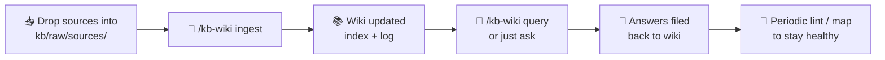

<div align="center">

# 🛠️ Agent Skills

**A collection of agent skills for [Claude Code](https://claude.com/claude-code)**

[](https://github.com/RayChang/agent-skills)
[](https://claude.com/claude-code)


[繁體中文](./README.md) · **English**

</div>

---

## 📚 Skills Overview

| Skill | Purpose | Primary Trigger |
|---|---|---|
| [📚 `kb-wiki`](#-kb-wiki) | LLM-driven personal knowledge base (Karpathy LLM Wiki pattern) | `/kb-wiki <op>` |
| [📝 `markitdown`](#-markitdown) | File / URL → Markdown conversion | Natural language |
| [✅ `cove`](#-cove) | Chain-of-Verification self-verification workflow | `/cove` |

---

## 📦 Installation

```bash
npx skills add RayChang/agent-skills@<skill-name>
```

> Installed skills live in `~/.claude/skills/<skill-name>/` and are auto-loaded on Claude Code startup.

---

## 🚀 Usage

Skills can be triggered in two ways:

### 1️⃣ Natural-language triggering

Describe what you need; Claude picks the right skill based on its description:

| Say this | Triggers |
|---|---|
| "Convert this PDF to markdown" | 📝 `markitdown` |
| "Set up a KB for this project" | 📚 `kb-wiki` |
| "Verify the last answer" | ✅ `cove` |

### 2️⃣ Slash command triggering

Type `/<skill-name>` or `/<skill-name> <operation>`:

```bash
/kb-wiki init        # Initialize the knowledge base
/kb-wiki ingest      # Ingest a new source
/cove                # Verify the last response
```

> 💡 Type `/` in Claude Code to browse available skills, or run `/help` for details.

---

## ✨ Skills

### 📚 `kb-wiki`

Based on [Andrej Karpathy's LLM Wiki pattern](https://gist.github.com/karpathy/442a6bf555914893e9891c11519de94f). Builds and maintains an LLM-driven personal knowledge base inside a project.

> The **LLM** writes and maintains the wiki content; the **human** curates sources and asks questions.

#### 🏗️ Three-Layer Architecture

| Layer | Location | Owner |
|---|---|---|
| **Raw sources** | `kb/raw/sources/` | Human (immutable) |
| **Wiki** | `kb/wiki/` | LLM (fully maintained) |
| **Schema** | `kb/schema.md` + `CLAUDE.md` | Human-defined, LLM-followed |

#### 🔧 Supported Operations

| Operation | Description |
|---|---|
| `init` | Initialize the KB, set up directory structure and schema |
| `ingest` | Process a new source document and update wiki pages |
| `query` | Answer a question from the wiki; file substantial answers back |
| `lint` | Health check: broken links, orphan pages, contradictions |
| `map` | Rebuild index, MOCs, and cross-links |
| `capture` | Extract design decisions and lessons after a milestone |

#### 📥 Install

```bash
npx skills add RayChang/agent-skills@kb-wiki
```

#### 🎬 First-Time Setup (init)

1. `cd` into the project where you want the knowledge base
2. Run `/kb-wiki init` (or tell Claude "initialize a KB for this project")
3. Claude reads `CLAUDE.md` / `README.md` / `package.json` and proposes a category structure for your confirmation
4. On confirmation, the following is created automatically:
   - 📁 `kb/raw/sources/`, `kb/raw/assets/` (raw layer — immutable)
   - 📁 `kb/wiki/{categories}/` (LLM-maintained wiki layer)
   - 📄 `kb/schema.md` (this project's KB conventions)
   - 📄 `kb/wiki/index.md`, `kb/wiki/log.md`
   - 📝 A `## Knowledge Base` section is appended to the project's `CLAUDE.md` so any future LLM agent entering the project auto-discovers the KB

#### 🔄 Daily Workflow



---

### 📝 `markitdown`

Uses Microsoft's [markitdown](https://github.com/microsoft/markitdown) to convert files or URLs to Markdown via `uvx` — zero install.

#### 📋 Supported Formats

| Category | Formats |
|---|---|
| **Documents** | PDF, DOCX, PPTX, XLSX, EPUB |
| **Web** | HTML, Wikipedia, RSS/Atom URLs |
| **Data** | CSV, JSON, XML |
| **Media** | Audio, YouTube URLs |
| **Other** | ZIP, Jupyter Notebook, Outlook `.msg` |

#### 📥 Install

```bash
npx skills add RayChang/agent-skills@markitdown
```

#### ⚙️ First-Time Setup

After install, run `/markitdown setup` once (or tell Claude "set up markitdown"). This appends a `## File & URL Reading` section to `~/.claude/CLAUDE.md` so Claude **auto-prefers markitdown over WebFetch/Read** whenever you hand it a file or URL. The operation is idempotent — if the section already exists, it skips.

For project-level registration instead, run `/markitdown setup --project` (writes to the project's `CLAUDE.md`).

---

### ✅ `cove`

Based on Meta AI's [Chain-of-Verification (CoVe) paper](https://arxiv.org/abs/2309.11495). A structured four-step self-verification workflow that reduces LLM hallucination.

Manually triggered with `/cove` to verify and revise a previous response (or specified content).

#### 🔄 Four-Step Flow

| Step | Action | Purpose |
|---|---|---|
| **1️⃣** | Identify the draft to verify | Establish baseline |
| **2️⃣** | Plan verification questions and tag each tier | Target facts, technical claims, logical assertions |
| **3️⃣** | Tier-based verification | `deep` → subagent (fresh context); `shallow` → in-context |
| **4️⃣** | Revise draft against verification results | Flag anything unverifiable |

> Suitable for fact-heavy answers, technical explanations, or any response where accuracy matters.

#### 🎯 Tier Routing

Not every claim deserves the same rigor. Each verification question is first classified as `deep` or `shallow`, then routed accordingly:

| Tier | Verification | When to apply |
|---|---|---|
| **🔬 `deep`** | Dispatch Agent subagent (fresh context, real isolation) | Specific numbers/versions/APIs, named references, legal/medical/compliance content, niche topics, conclusions the user will act on |
| **🪶 `shallow`** | In-context verification (soft constraint: don't reference the draft) | < 3 claims, common knowledge, subjective opinions, context-dependent claims |

> 💡 The `deep` path is close to the paper's **Factored** variant — fresh context prevents the model from anchoring on and repeating its own draft hallucinations. Deep questions can be dispatched in parallel to keep latency low.

#### 📥 Install

```bash
npx skills add RayChang/agent-skills@cove
```
