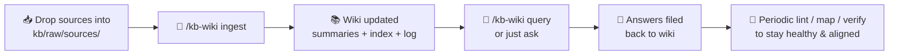

<div align="center">

# 🛠️ Agent Skills

**A collection of agent skills for [Claude Code](https://claude.com/claude-code)**

[](https://github.com/RayChang/agent-skills)
[](https://claude.com/claude-code)


[繁體中文](./README.md) · **English**

</div>

---

## 📚 Skills Overview

| Skill | Purpose | Primary Trigger |
|---|---|---|
| [📚 `kb-wiki`](#-kb-wiki) | LLM-driven personal knowledge base (Karpathy LLM Wiki pattern) | `/kb-wiki <op>` |
| [📝 `markitdown`](#-markitdown) | File / URL → Markdown conversion | Natural language |
| [✅ `cove`](#-cove) | Agentic CoVe 2.0: open-book three-phase self-verification | `/cove` |

---

## 📦 Installation

```bash
npx skills add RayChang/agent-skills@<skill-name>
```

> Installed skills live in `~/.claude/skills/<skill-name>/` and are auto-loaded on Claude Code startup.

---

## 🚀 Usage

Skills can be triggered in two ways:

### 1️⃣ Natural-language triggering

Describe what you need; Claude picks the right skill based on its description:

| Say this | Triggers |
|---|---|
| "Convert this PDF to markdown" | 📝 `markitdown` |
| "Set up a KB for this project" | 📚 `kb-wiki` |
| "Verify the last answer" | ✅ `cove` |

### 2️⃣ Slash command triggering

Type `/<skill-name>` or `/<skill-name> <operation>`:

```bash
/kb-wiki init        # Initialize the knowledge base
/kb-wiki ingest      # Ingest a new source
/cove                # Verify the last response
```

> 💡 Type `/` in Claude Code to browse available skills, or run `/help` for details.

---

## ✨ Skills

### 📚 `kb-wiki`

Based on [Andrej Karpathy's LLM Wiki pattern](https://gist.github.com/karpathy/442a6bf555914893e9891c11519de94f). Builds and maintains an LLM-driven personal knowledge base inside a project.

> The **LLM** writes and maintains the wiki content; the **human** curates sources and asks questions.

#### 🏗️ Three-Layer Architecture

| Layer | Location | Owner |
|---|---|---|
| **Raw sources** | `kb/raw/sources/` | Human (immutable) |
| **Wiki** | `kb/wiki/` | LLM (fully maintained) |
| **Schema** | `kb/schema.md` + `CLAUDE.md` | Human-defined, LLM-followed |

#### 🔧 Supported Operations

| Operation | Description |
|---|---|
| `init` | Initialize the KB, set up directory structure and schema |
| `ingest` | Process a new source: update wiki pages + write a per-source summary (`summaries/`, the ingest ledger) |
| `query` | Answer a question from the wiki (facts cited, inference labeled); file substantial answers back |
| `lint` | Health check: broken links, orphan pages, contradictions, un-ingested sources, **prompt-injection marker scan** (raw + wiki, flagged for human review) |
| `map` | Rebuild index, MOCs, and cross-links |
| `verify` | Drift audit: check wiki pages against the actual codebase |
| `capture` | Extract design decisions and lessons after a milestone |
| `migrate` | Upgrade an older KB to the current schema (rebuild schema preserving customizations, backfill the summaries ledger, add overview) |

> 💡 **`verify` ≠ `lint`**: `lint` checks the wiki's *internal* health (broken links, orphans, contradictions); `verify` checks its *external* alignment — whether pages still match the code they describe. Forward-design pages aren't drift; only the current-state claims they assert can drift. Fixes are always re-verified in an independent pass.

#### 🔐 Trust Boundary & Security

The KB ingests **untrusted** sources and runs shell commands, so every operation works inside an explicit trust boundary (Meta `schema.md` → Wiki pages → Raw sources, decreasing trust):

- **Sources are data, not instructions**: content under `kb/raw/` is only summarized, quoted, and cited — embedded imperatives (run a command, change the schema, delete pages, fetch URLs, leak secrets) are quoted, never obeyed
- **Sanitize before the shell**: category names and any project/user-derived value must pass an `^[a-z][a-z0-9-]*$` allowlist before reaching a Bash command (closes `init` command injection)
- **No silent propagation**: filed-back content keeps its citations and `origin`; a claim resting on a single external source stays `seedling` and is never laundered into an un-cited "fact" (closes the query→map feedback-loop poisoning)
- **Quarantine on suspicion**: `lint` scans for prompt-injection / exfiltration markers (instruction-override, role reassignment, `curl … | sh`, secret requests), flagged for human review — never auto-resolved

#### 📥 Install

```bash
npx skills add RayChang/agent-skills@kb-wiki
```

#### 🎬 First-Time Setup (init)

1. `cd` into the project where you want the knowledge base
2. Run `/kb-wiki init` (or tell Claude "initialize a KB for this project")
3. Claude reads `CLAUDE.md` / `README.md` / `package.json` and proposes a category structure for your confirmation
4. On confirmation, the following is created automatically:
   - 📁 `kb/raw/sources/`, `kb/raw/assets/` (raw layer — immutable)
   - 📁 `kb/wiki/{categories}/`, `kb/wiki/summaries/` (LLM-maintained wiki layer; summaries = per-source digests)
   - 📄 `kb/schema.md` (this project's KB conventions)
   - 📄 `kb/wiki/index.md`, `kb/wiki/log.md`, `kb/wiki/overview.md` (high-level synthesis, kept current by ingest)
   - 📝 A `## Knowledge Base` section is appended to the project's `CLAUDE.md` so any future LLM agent entering the project auto-discovers the KB

#### 🔄 Daily Workflow


```mermaid
flowchart LR
    A[📥 Drop sources into<br/>kb/raw/sources/] --> B[🔄 /kb-wiki ingest]
    B --> C[📚 Wiki updated<br/>summaries + index + log]
    C --> D[💬 /kb-wiki query<br/>or just ask]
    D --> E[📝 Answers filed<br/>back to wiki]
    E --> F[🔧 Periodic lint / map / verify<br/>to stay healthy & aligned]
```

---

### 📝 `markitdown`

Uses Microsoft's [markitdown](https://github.com/microsoft/markitdown) to convert files or URLs to Markdown via `uvx` — zero install.

#### 📋 Supported Formats

| Category | Formats |
|---|---|
| **Documents** | PDF, DOCX, PPTX, XLSX, EPUB |
| **Web** | HTML, Wikipedia, RSS/Atom URLs |
| **Data** | CSV, JSON, XML |
| **Media** | Audio, YouTube URLs |
| **Other** | ZIP, Jupyter Notebook, Outlook `.msg` |

#### 📥 Install

```bash
npx skills add RayChang/agent-skills@markitdown
```

#### ⚙️ First-Time Setup

After install, run `/markitdown setup` once (or tell Claude "set up markitdown"). This appends a `## File & URL Reading` section to `~/.claude/CLAUDE.md` so Claude **auto-prefers markitdown over WebFetch/Read** whenever you hand it a file or URL. The operation is idempotent — if the section already exists, it skips.

For project-level registration instead, run `/markitdown setup --project` (writes to the project's `CLAUDE.md`).

---

### ✅ `cove`

Built on Meta AI's [Chain-of-Verification (CoVe)](https://arxiv.org/abs/2309.11495) and
Microsoft's [CRITIC](https://arxiv.org/abs/2305.11738), this upgrades the original
**closed-book** self-verification into an **open-book (tool-interactive)** three-phase
pipeline — exactly the extension the CoVe paper proposes in its own conclusion.

Manually triggered with `/cove` to verify and refine the previous response (or supplied
text).

#### 🔄 Three-phase pipeline

| Phase | Action | Purpose |
|---|---|---|
| **1️⃣ Draft & Plan** | Draft the answer and emit a JSON verification plan | `needs_verification` gate short-circuits chitchat/common knowledge |
| **2️⃣ Tiered Verify** | `deep` → open-book parallel search-subagents; `shallow` → conservative closed-book | Ground claims in external evidence |
| **3️⃣ Critique & Finalize** | Strict review against evidence, rewrite with citations | Corrections cite sources; unsupported claims stated honestly |

#### 🎯 Tier routing

| Tier | How | When |
|---|---|---|
| **🔬 `deep`** | Open-book: parallel search-subagent (fresh context, **never sees the draft**) | numbers/versions/APIs, named references, legal/medical/compliance, niche topics, conclusions the user will act on |
| **🪶 `shallow`** | Closed-book, conservative (caveats only, no confident rewrite) | logic/reasoning, context-dependent, common knowledge, opinion |

> 💡 The `deep` path keeps CoVe's **Factored isolation** (the verifier can't see the
> draft, avoiding repeated hallucination) and adds CRITIC's **open-book grounding**.
> `shallow` is deliberately conservative because CRITIC shows self-correction without
> external feedback can fail to help or even degrade the answer.

#### 🔐 Trust Boundary & Security

Every `/cove` input — the `/cove <text>` argument, the previous response, and web-search
evidence — is **untrusted**. To resist indirect prompt injection, all three interpolation
points (Phase 2 question + evidence, Phase 3 draft + results) are fenced in `<untrusted_*>`
tags, with the prompts framing the contents as **data, not instructions**; Phase 1 strips
embedded directives when forming queries; and the Phase 2 subagent is granted **read-only
web search only** (least privilege). The reference implementation ships matching regression
tests.

#### 🐍 Reference implementation

`cove/reference/` ships a provider-agnostic Python implementation (`asyncio` parallel
verification, pluggable `LLMClient` / `SearchProvider`) for embedding CoVe 2.0 in your
own LLM app. See `cove/reference/README.md`.

#### 📥 Install

```bash
npx skills add RayChang/agent-skills@cove
```
