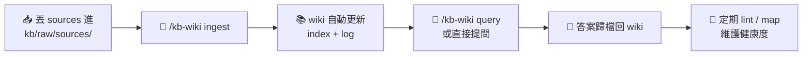

<div align="center">

# 🛠️ Agent Skills

**適用於 [Claude Code](https://claude.com/claude-code) 的 agent skills 集合**

[](https://github.com/RayChang/agent-skills)
[](https://claude.com/claude-code)


**繁體中文** · [English](./README.en.md)

</div>

---

## 📚 Skills 總覽

| Skill | 用途 | 主要觸發 |
|---|---|---|
| [📚 `kb-wiki`](#-kb-wiki) | LLM 驅動的個人知識庫（Karpathy LLM Wiki pattern） | `/kb-wiki <op>` |
| [📝 `markitdown`](#-markitdown) | 檔案／URL → Markdown 轉換 | 自然語言 |
| [✅ `cove`](#-cove) | Chain-of-Verification 自我驗證流程 | `/cove` |

---

## 📦 安裝

```bash
npx skills add RayChang/agent-skills@<skill-name>
```

> 安裝後 skill 會放在 `~/.claude/skills/<skill-name>/`，Claude Code 啟動時會自動載入。

---

## 🚀 使用

Skills 可透過兩種方式觸發：

### 1️⃣ 自然語言觸發

直接描述需求，Claude 會根據 skill 的描述自動選用：

| 說出這句話 | 自動觸發 |
|---|---|
| 「把這份 PDF 轉成 markdown」 | 📝 `markitdown` |
| 「幫這個專案建立 KB」 | 📚 `kb-wiki` |
| 「對剛剛的回答做驗證」 | ✅ `cove` |

### 2️⃣ Slash command 觸發

直接輸入 `/<skill-name>` 或 `/<skill-name> <operation>`：

```bash
/kb-wiki init        # 初始化知識庫
/kb-wiki ingest      # 錄入新來源
/cove                # 驗證上一則回答
```

> 💡 在 Claude Code 中輸入 `/` 可查看所有可用 skill，或執行 `/help` 查看說明。

---

## ✨ Skills

### 📚 `kb-wiki`

基於 [Andrej Karpathy 的 LLM Wiki 模式](https://gist.github.com/karpathy/442a6bf555914893e9891c11519de94f)，在專案中建立並維護 LLM 驅動的個人知識庫。

> 由 **LLM** 負責撰寫與維護 wiki 內容，**人類** 負責整理來源資料與提問。

#### 🏗️ 三層架構

| 層級 | 位置 | 擁有者 |
|---|---|---|
| **Raw sources** | `kb/raw/sources/` | 人類（不可變） |
| **Wiki** | `kb/wiki/` | LLM（完全維護） |
| **Schema** | `kb/schema.md` + `CLAUDE.md` | 人類定義、LLM 遵循 |

#### 🔧 支援操作

| 操作 | 說明 |
|---|---|
| `init` | 初始化 KB，建立目錄結構與 schema |
| `ingest` | 處理新的來源文件，更新 wiki 頁面 |
| `query` | 以 wiki 內容回答問題，答案歸檔回 wiki |
| `lint` | 健康檢查：斷鏈、孤立頁面、矛盾內容 |
| `map` | 重建 index、MOC 及交叉連結 |
| `capture` | 在里程碑結束後萃取設計決策與教訓 |

#### 📥 安裝

```bash
npx skills add RayChang/agent-skills@kb-wiki
```

#### 🎬 首次使用（init）

1. `cd` 進入要建立知識庫的專案目錄
2. 執行 `/kb-wiki init`（或告訴 Claude「初始化這個專案的 KB」）
3. Claude 讀取 `CLAUDE.md` / `README.md` / `package.json`，提案合適的分類結構讓你確認
4. 確認後自動建立：
   - 📁 `kb/raw/sources/`、`kb/raw/assets/`（原始素材層，不可變動）
   - 📁 `kb/wiki/{categories}/`（LLM 維護的 wiki 層）
   - 📄 `kb/schema.md`（本專案的 KB 規則）
   - 📄 `kb/wiki/index.md`、`kb/wiki/log.md`
   - 📝 在專案根的 `CLAUDE.md` 附加 `## Knowledge Base` 區塊，讓後續任何 LLM agent 進專案都能自動發現 KB

#### 🔄 日常流程



---

### 📝 `markitdown`

使用 Microsoft 的 [markitdown](https://github.com/microsoft/markitdown) 將檔案或 URL 轉換為 Markdown，透過 `uvx` 免安裝執行。

#### 📋 支援格式

| 類別 | 格式 |
|---|---|
| **文件** | PDF、DOCX、PPTX、XLSX、EPUB |
| **網頁** | HTML、Wikipedia、RSS/Atom URL |
| **資料** | CSV、JSON、XML |
| **媒體** | 音訊、YouTube URL |
| **其他** | ZIP、Jupyter Notebook、Outlook `.msg` |

#### 📥 安裝

```bash
npx skills add RayChang/agent-skills@markitdown
```

#### ⚙️ 首次使用（setup）

安裝後執行一次 `/markitdown setup`（或告訴 Claude「設定 markitdown」），會在 `~/.claude/CLAUDE.md` 自動追加 `## File & URL Reading` 區塊，讓 Claude 日後收到檔案或 URL 時**優先使用 markitdown 而非 WebFetch/Read**。操作是 idempotent 的——已有區塊就跳過。

要寫進專案層級的設定，執行 `/markitdown setup --project`（對象改為該專案的 `CLAUDE.md`）。

---

### ✅ `cove`

基於 Meta AI 的 [Chain-of-Verification（CoVe）論文](https://arxiv.org/abs/2309.11495)，透過結構化的四步驟自我驗證流程減少 LLM 的 hallucination。

以 `/cove` 手動觸發，對前一個回應（或指定內容）進行驗證與修訂。

#### 🔄 四步驟流程

| Step | 動作 | 目的 |
|---|---|---|
| **1️⃣** | 取得待驗證的初稿 | 建立基準 |
| **2️⃣** | 規劃驗證問題並標記 tier | 針對關鍵事實、技術陳述、邏輯斷言 |
| **3️⃣** | 分層驗證 | `deep` 走 subagent（fresh context）、`shallow` 留 in-context |
| **4️⃣** | 對照結果修訂初稿 | 標示無法驗證的內容 |

> 適合用於事實密集的回答、技術說明、或任何對準確性要求較高的場景。

#### 🎯 分層驗證（Tier Routing）

並非所有 claim 都值得同等 rigor。每個驗證問題會先分類為 `deep` 或 `shallow`，再決定驗證方式：

| Tier | 驗證方式 | 適用 |
|---|---|---|
| **🔬 `deep`** | Dispatch Agent subagent（fresh context，真正隔離） | 具體數字／版本／API、具名引用、法律/醫療/合規、冷門主題、User 會直接採用的結論 |
| **🪶 `shallow`** | In-context 驗證（軟約束：不參照原稿） | <3 claim、常識、主觀觀點、依賴對話 context |

> 💡 `deep` 路徑接近原論文的 **Factored** 變體——fresh context 防止模型錨定自己的原稿而重複幻覺；`deep` 問題可平行 dispatch 壓低延遲。

#### 📥 安裝

```bash
npx skills add RayChang/agent-skills@cove
```
